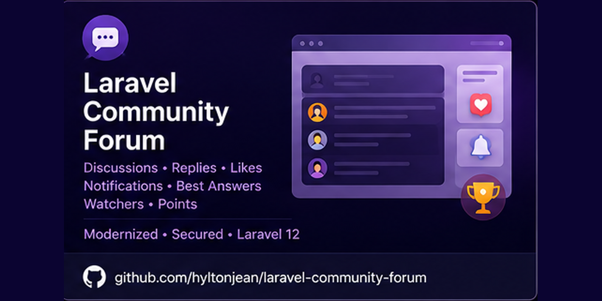

<p align="center">
  
</p>

# Laravel Community Forum

A Laravel community forum with channels, discussions, replies, likes, watchers, best-answer workflows, notifications and social authentication.

Originally built on Laravel 7, this project has been deliberately modernized and security-hardened through successive framework upgrades to **Laravel 12**. The goal of the modernization work is to preserve the original forum domain while improving authorization, mutation safety, dependency health, automated testing and build reproducibility.

## Modernization highlights

- Upgraded the application from **Laravel 7 to Laravel 12** on **PHP 8.2+**.
- Replaced obsolete framework-era dependencies with Laravel 12-compatible packages, including Socialite 5 and PHPUnit 11.
- Replaced the legacy Laravel Mix / Webpack / Vue 2 frontend scaffold with a smaller **Vite + Bootstrap 5** asset pipeline.
- Converted state-changing forum actions to CSRF-protected POST, PATCH and DELETE requests rather than GET requests.
- Added ownership checks for discussion and reply updates and authorization around best-answer selection.
- Made likes and discussion watchers idempotent and backed them with database uniqueness constraints.
- Added transactional handling for reply points, best-answer points and watcher notifications.
- Replaced the legacy Markdown package with CommonMark 2 and added regression coverage for unsafe raw HTML.
- Added GitHub Actions verification for dependency audits, Laravel tests and the production frontend build.

## Current stack

**Backend:** PHP 8.2+, Laravel 12, Eloquent ORM, Laravel Socialite, CommonMark 2  
**Frontend:** Vite, Bootstrap 5, Sass  
**Testing:** PHPUnit 11, Laravel feature tests, SQLite in-memory test database  
**Quality:** Composer validation/audit, npm audit, production asset build, GitHub Actions CI

## Forum capabilities

- Channels and threaded discussions
- Replies with validation and ownership rules
- Likes with duplicate prevention
- Discussion watching/unwatching with duplicate prevention
- Best-answer selection restricted to the discussion owner
- User points for participation and accepted answers
- Watcher notifications while avoiding self-notification
- Social authentication through Laravel Socialite
- Markdown rendering with raw HTML disabled

## Automated verification

The hardening suite currently covers discussion and reply authorization, reply validation, idempotent likes/watchers, best-answer rules, points, watcher notifications and Markdown safety.

CI also verifies:

```text
composer validate
composer audit --locked
php artisan test
npm audit --audit-level=high
npm run build
```

## Local setup

```bash
composer install
cp .env.example .env
php artisan key:generate
php artisan migrate
npm ci
npm run build
php artisan serve
```

Configure your database and any Socialite provider credentials in `.env` before using those integrations.

## Why this repository exists

This repository is both a working forum application and a modernization exercise: taking an older Laravel application forward without rewriting the domain from scratch. The emphasis is on framework migration, security hardening, regression tests, deterministic dependencies and maintainable CI rather than simply changing version numbers.

## License

This project is licensed under the [MIT License](LICENSE).
